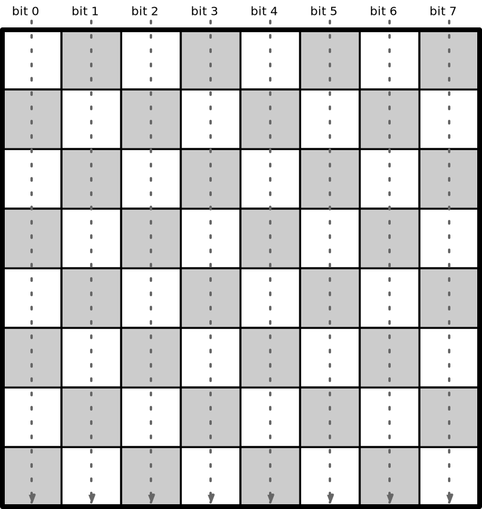
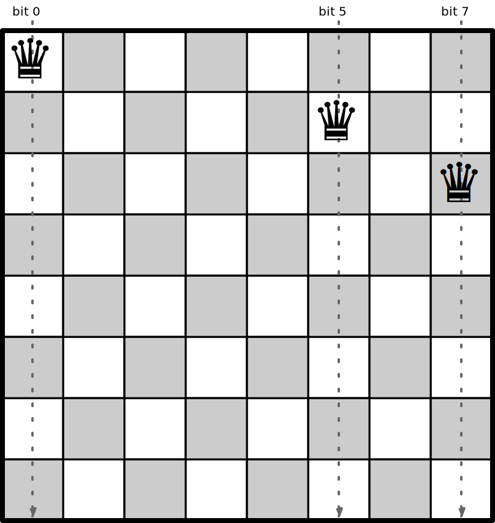
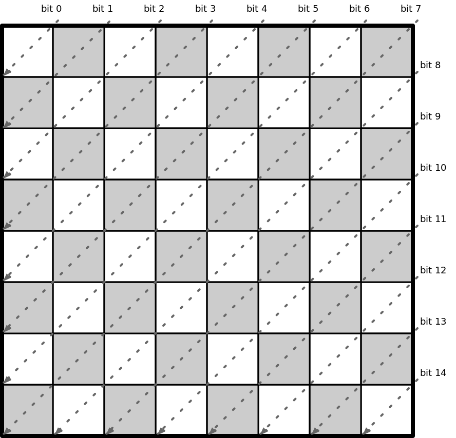
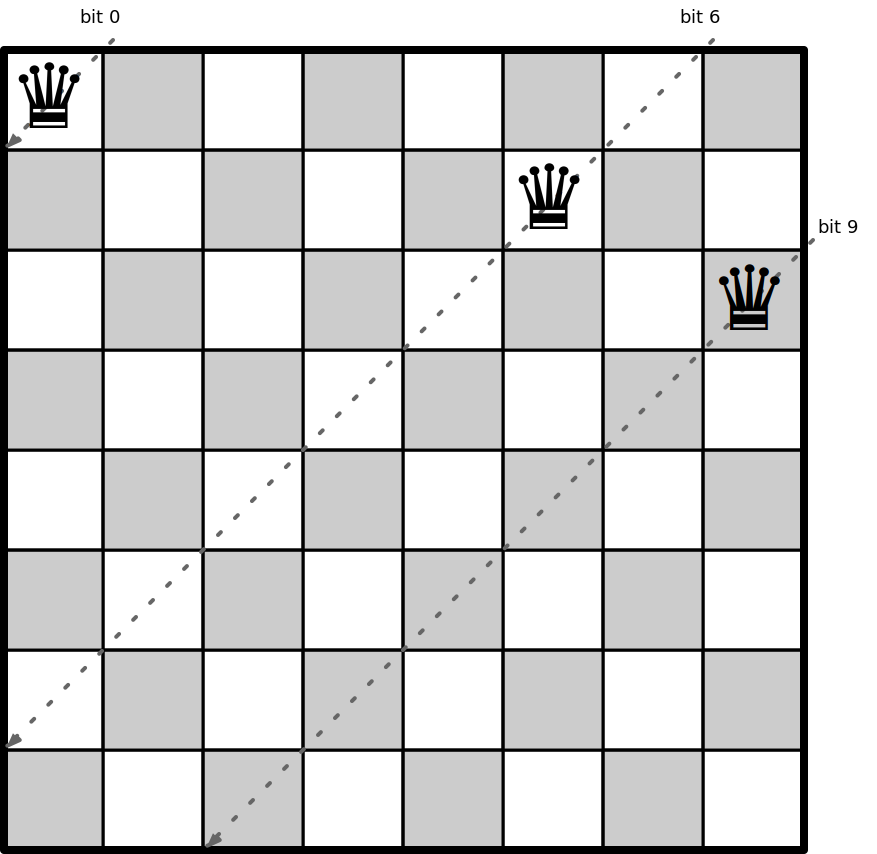
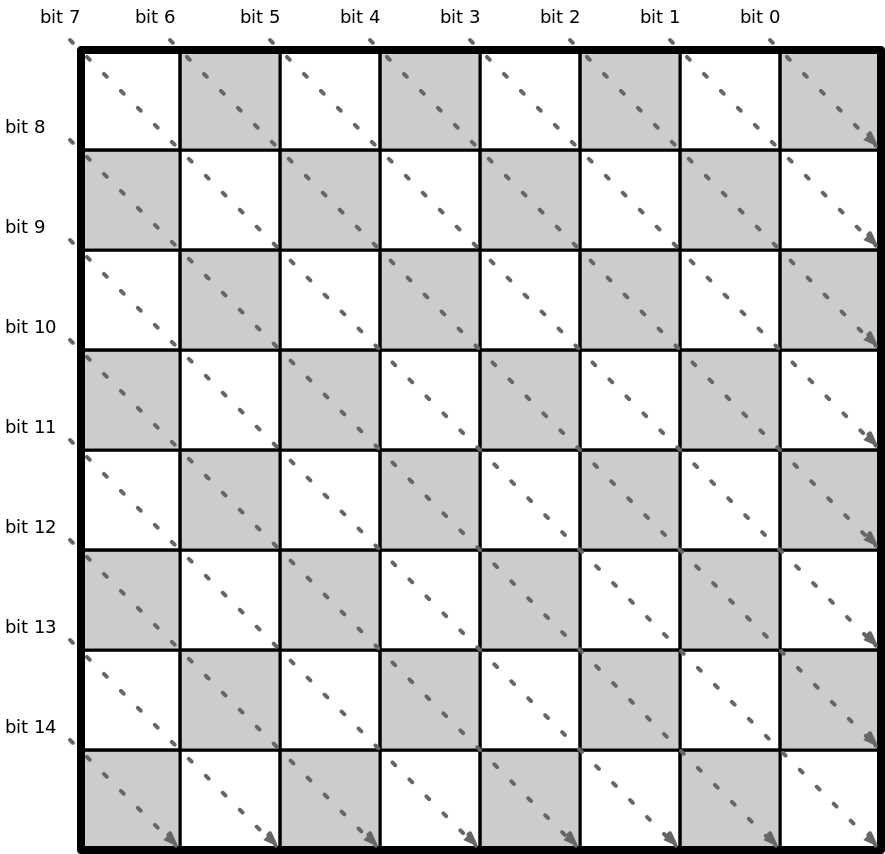
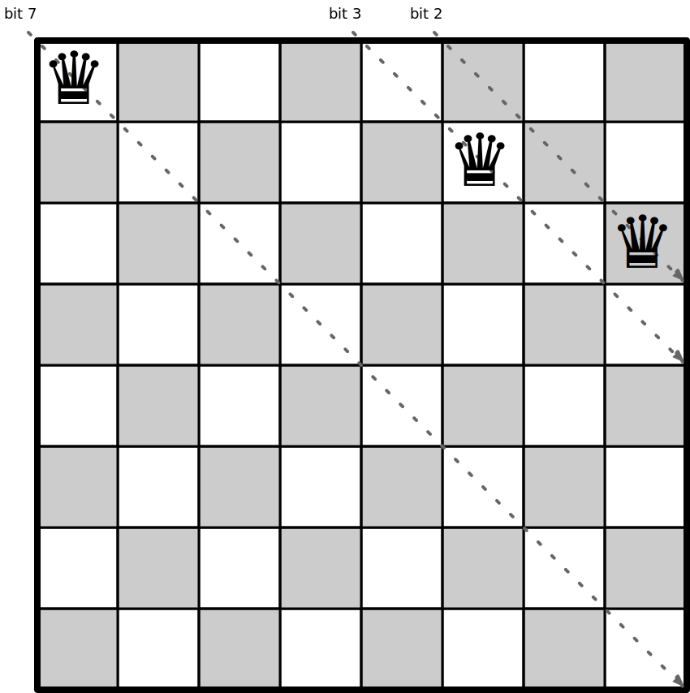
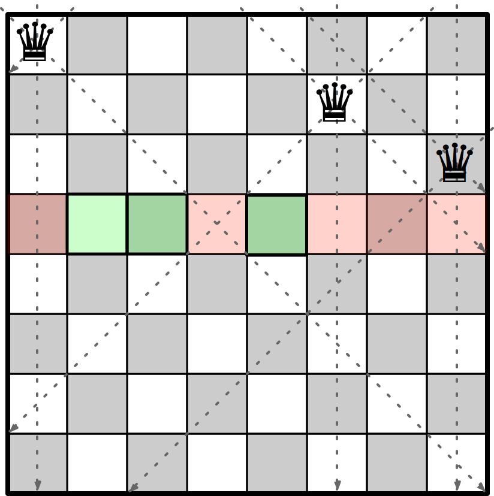
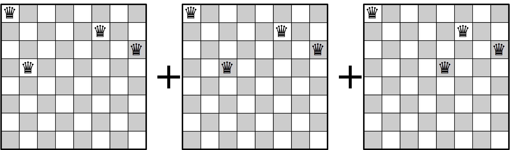

# N-Queens Problem

This project contains programs that count solutions to the [N Queens Problem](https://en.wikipedia.org/wiki/Eight_queens_puzzle).

# Running

To run any of the Queens programs, just go to the language folder of your choice and run the script run.sh.

For example, to run using Java:
``` bash
java/run.sh Queens 8 14
```

Here, first and second parameters defines the starting and ending board sizes.

For example,
run.sh Queens 8 14

will calculate solutions starting from 8x8 board size to 14x14 board size.

# Some overview on N-Queens Problem:
* N-queens is very well-known problem in the community of computer science in which we need to find how can we place N-queens on an N X N board without any of them attacking each other.
* This problem gets exponentially harder as the value of N increases, because we want to count the number of possible solutions instead of just figuring out if a solution exists.
* The current world record for counting solutions is for [board size 27](https://github.com/preusser/q27).


# Algorithm Description

We start with an empty board and count the solutions for boards found by placing a queen at each column on the first row.
For each of those boards, we count solutions recursively by placing queens on each available column on the next row.

At each stage, we have a board with queens placed up to a certain row. We proceed with these steps:

1. Find the available (unattacked) columns on the next row.
2. Find a new board for each of the available columns by placing a queen in the column.
3. Count the solutions for each of the new boards (recursively).
4. Return the sum of the counts.

To record the placement of queens, we keep track of these items:

1. The size of the board.
2. The current row.
3. The columns with queens in them.
4. The diagonals with queens in them.

We use bit sets to mark the columns and diagonals with queens in them.
Using a 64-bit integer as a representation of an immutable bit set,
and with these we can record up to 64 columns or diagonals.

We track the columns with queens in them using a bit set for the columns:



For example, with these three queens placed, bits 0, 5 and 7 are set,
giving an int value of 2<sup>0</sup> + 2<sup>5</sup> + 2<sup>7</sup>
= 1 + 32 + 128 = 161.



We track the diagonals with two bit sets. The first one has the diagonals to the left going down the board:



With the three queens placed, bits 0, 6 and 9 are set,
giving an int value of 2<sup>0</sup> + 2<sup>6</sup> + 2<sup>9</sup>
= 1 + 64 + 512 = 577.



The other diagonals go to the right going down the board:



With the three queens placed, bits 2, 3 and 7 are set,
giving an int value of 2<sup>2</sup> + 2<sup>3</sup> + 2<sup>7</sup>
= 4 + 8 + 128 = 140.



The available columns on the next row are those that are not currently attacked:



The number of solutions for the current position is the sum of the number of solutions for the boards found by placing queens on the available positions:




All of the programs use three functions:

* `ok(board, col)` returns true if the column is not currently attacked on the given board.
* `place(board, col)` returns a new board by adding a queen on the next row at the given column.
* `solve(board)` returns the number of solutions for the given board.

Pseudo-code for `ok()` is:

```
return cols bit at col is not set
  and diag1 bit at row+col is not set
  and diag2 bit at row-col+size-1 is not set
```

Pseudo-code for `place()` is:

```
return new board of same size, with current row incremented by 1,
  cols with bit col set,
  diag1 with bit row+col set,
  diag2 with bit row-col+size-1 set
```

Pseudo-code for `solve()` is:

```
if row == size then return 1      // full board: count one solution
else
  return sum over col in 0..size-1 where ok(board, col) of:
    solve(place(board, col))
```

# References

* [N Queens Problem (Wikipedia)](https://en.wikipedia.org/wiki/Eight_queens_puzzle)
* [Based on the idea from this paper by Martin Richards](http://citeseerx.ist.psu.edu/viewdoc/download?doi=10.1.1.51.7113&rep=rep1&type=pdf)
